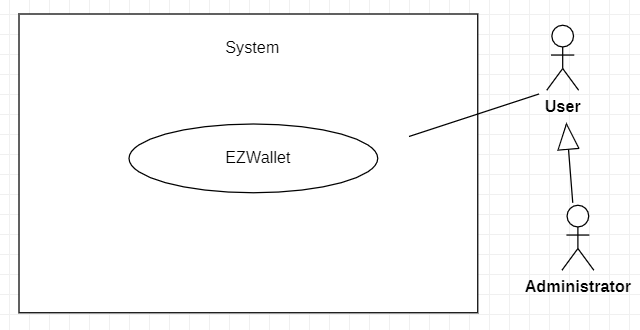
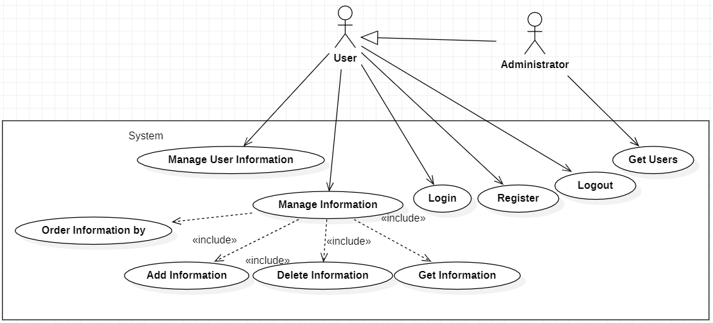
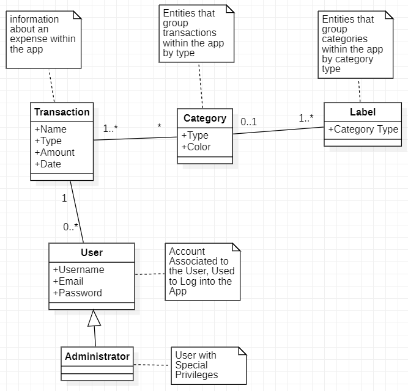
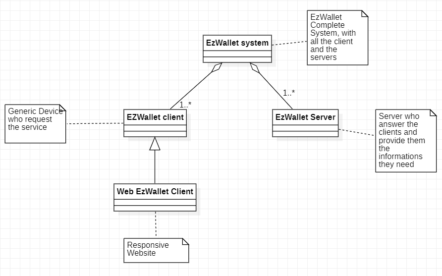
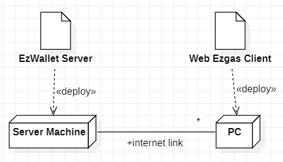

# Requirements Document - future EZWallet

Date: 22/04/2023

Version: V2 - description of EZWallet in FUTURE form (as proposed by the team)

 
| Version number | Change |
| ----------------- |:-----------|
| 1.0 | Stakeholders, Context Diagram, Interfaces, stories and Personas | 

# Contents

- [Informal description](#informal-description)
- [Stakeholders](#stakeholders)
- [Context Diagram and interfaces](#context-diagram-and-interfaces)
	+ [Context Diagram](#context-diagram)
	+ [Interfaces](#interfaces) 
	
- [Stories and personas](#stories-and-personas)
- [Functional and non functional requirements](#functional-and-non-functional-requirements)
	+ [Functional Requirements](#functional-requirements)
	+ [Non functional requirements](#non-functional-requirements)
- [Use case diagram and use cases](#use-case-diagram-and-use-cases)
	+ [Use case diagram](#use-case-diagram)
	+ [Use cases](#use-cases)
    	+ [Relevant scenarios](#relevant-scenarios)
- [Glossary](#glossary)
- [System design](#system-design)
- [Deployment diagram](#deployment-diagram)

# Informal description
EZWallet (read EaSy Wallet) is a software application designed to help individuals and families keep track of their expenses. Users can enter and categorize their expenses, allowing them to quickly see where their money is going. EZWallet is a powerful tool for those looking to take control of their finances and make informed decisions about their spending.
## Business Model
EzWallet is a free-to-use app. It's implemented with a desktop GUI, that allows the user and the administrator to easily perform all the activities related to his expenses. 

# Stakeholders

| Stakeholder name  | Description | 
| ----------------- |:-----------:|
|   StakeHolder1: Owner    |    investor, owns the product     |
|   StakeHolder2: User    |    person interested in charting its expenses      |
|   StakeHolder3: DB Administrator    |    person in charge of managing the DB     |
|   StakeHolder4: Developer   | person in charge of developing the software product  |
|   Stakeholder5: Administrator | a person who has rights to manage users in the application |

# Context Diagram and interfaces

## Context Diagram

## Interfaces
| Actor | Logical Interface | Physical Interface  |
| ------------- |:-------------:| -----:|
|   User     | PC | Graphical User Interface (to be defined) |
|   Administrator | PC | Graphical User Interface (to be defined) |

# Stories and personas
- Persona 1: High income professional, male, married, with no children, 40 yo
	+ Story: He thought that invest into this type of application could be profitable. Every month he checks how the project is going.
- Persona 2: Professional, female, divorced, with children, 40 yo
	+ Story: She needs to monitor her expenses, interested in understanding where her money has been spent.
- Persona 3: Student, worker part-time, male, 22, low income
	+ Story: Off-campus student interested in managing his finances better, since he has a part-time job but monthly expenses.
- Persona 4: Student, female, 22, no income 
	+ Story: Student Offsite, interested in managing the money her family sends her.
- Persona 5: professional, female, married, with children, 30 yo
	+ Story: Figure with experience in web application for expense management, proficient in managing a great amount of accounts.

# Functional and non functional requirements

## Functional Requirements

| ID        | Description  |
| ------------- |:-------------:| 
|  F1     | Authorize and Authenticate |
|  F1.1     | Log In |
|  F1.2  | Log Out |
|  F1.3	|	Create Account	|
|  F2 | Manage Expenses |
|  F2.1 | Manage Categories |
|  F2.1.1| Create Category |
|  F2.1.2| Get Categories |
|  F2.1.3| Delete Category |
|  F2.1.4| Order Categories |
|  F2.2 | Manage Transactions |
|  F2.2.1| Create Transaction |
|  F2.2.2| Get Transactions |
|  F2.2.3| Delete Transaction |
|  F2.2.4| Order Transaction |
|  F2.3 | Manage Labels |
|  F2.3.1| Get Labels |
|  F2.3.2| Order Labels |
|  F3    | Manage User Information |
|  F3.1	|	Get Users	|
|  F3.2	|	Get User By Username	|
|  F3.2.1 | Modify Password |

## Non Functional Requirements

| ID        | Type (efficiency, reliability, ..)           | Description  | Refers to |
| ------------- |:-------------:| :-----:| -----:|
|  NFR1     | Efficiency | Each function less than ½ sec | F1,F2 |
|  NFR2     | Portability | Currency is Euro | F2.2,F2.3 |
|  NFR3     | Usability | Training Time 1 Hour, Average Number of Errors less than 2 | F1,F2 |

# Use case diagram and use cases

## Use case diagram

### Use case 1, UC1 (Register)
| Actors Involved        | User,Administrator |
| ------------- |:-------------:| 
|  Precondition     | <u>User</u> opened the application |
|  Post condition     | <u>User</u> is registered |
|  Nominal Scenario     | <u>User</u>, initially on the page, decides to register for the first time. |
|  Variants     | <u>User</u> is already registered |
|  Exceptions     | password format invalid |

##### Scenario 1.1

| Scenario 1.1 | Register |
| ------------- |:-------------:| 
|  Precondition     | <u>User</u> is not registered |
|  Post condition     | <u>User</u> is registered and logged in |
| Step#        | Description  |
|  1     | <u>User</u> clicks "not signed up? Create an account" link. |  
|  2     | <u>User</u> enters username, e-mail and password and confirm password. |  
|  3     | <u>User</u> clicks "sign up" button. |  
|  4     | System confirm the registration after checking if the user doesn't exists. |
|  5     | <u>User</u> is logged. |  

##### Scenario 1.2

| Scenario 1.2 |  User already exists |
| ------------- |:-------------:| 
|  Precondition     | <u>User</u> is not registered |
|  Post condition     | <u>User</u> is not registered  |
| Step#        | Description  |
|  1     | <u>User</u> enters username,email and password. |  
|  2     | Email found in the database. |
|  3     | System asks again the data. |

### Use case 2, UC2 (Login)
| Actors Involved        | User,Administrator |
| ------------- |:-------------:| 
|  Precondition     | <u>User</u> opened the application |
|  Post condition     | <u>User</u> is logged |
|  Nominal Scenario     | <u>User</u>, initially on the page, decides to login. |
|  Variants     | <u>User</u> is not registered  |
|  Exceptions     | wrong username or password |

##### Scenario 2.1 

| Scenario 2.1 | Login User |
| ------------- |:-------------:| 
|  Precondition     | <u>User</u> is registered and not logged in |
|  Post condition     | <u>User</u> is Logged In and can access his account |
| Step#        | Description  |
|  1     | <u>User</u> enters email and password. |  
|  2     | <u>User</u> confirms the login by clicking on the "Login" button. |

##### Scenario 2.2

| Scenario 2.2 | Login Administrator |
| ------------- |:-------------:| 
|  Precondition     | <u>Administrator</u> is not logged in |
|  Post condition     | <u>Administrator</u> is Logged In and can access his account |
| Step#        | Description  |
|  1     | <u>Administrator</u> enters email and password. |  
|  2     | <u>Administrator</u> confirms the login by clicking on the "Login as Administrator" button. |

##### Scenario 2.3

| Scenario 2.3 | Wrong password  |
| ------------- |:-------------:| 
|  Precondition     | <u>User</u> is not logged in |
|  Post condition     | <u>User</u> is  not logged in |
| Step#        | Description  |
|  1     | <u>User</u> enters email and password. |  
|  2     | Password is wrong. |
|  3     | System asks again the data. |

##### Scenario 2.4

| Scenario 2.4 | User doesn't exists  |
| ------------- |:-------------:| 
|  Precondition     | <u>User</u> is not logged in |
|  Post condition     | <u>User</u> is  not logged in |
| Step#        | Description  |
|  1     | <u>User</u> enters email and password. |  
|  2     | Email not found in the database |
|  3     | System asks again the data. |

### Use case 3, UC3 Logout
| Actors Involved        | User,Administrator |
| ------------- |:-------------:| 
|  Precondition     | <u>User</u> is already logged in |
|  Post condition     | <u>User</u> is logged out |
|  Nominal Scenario     | <u>User</u>, initially logged in, decides to logout. |
|  Variants     |  |
|  Exceptions     |  |

##### Scenario 3.1

| Scenario 3.1 | Logout |
| ------------- |:-------------:| 
|  Precondition     | <u>User</u> is already logged in |
|  Post condition     | <u>User</u> is logged out |
| Step#        | Description  |
|  1     | <u>User</u> clicks the settings icon. |  
|  2     | <u>User</u> clicks the logout button. |  
|  3     | System confirms the logout. |

### Use case 4, UC4 (Get Information)

| Actors Involved        | User,Administrator |
| ------------- |:-------------:| 
|  Precondition     | <u>User</u> is logged in and wants to see all categories/labels/transaction inserted. |
|  Post condition     | <u>User</u> retrieves the information he wants. |
|  Nominal Scenario     | <u>User</u>, initially logged in on the page, wants to find information by clicking on the relative button. |
|  Variants     | <u>User</u> wants to see all categories.  <u>User</u> wants to see all labels.   <u>User</u> wants to see all transaction.  |
|  Exceptions     |  |

##### Scenario 4.1 

| Scenario 4.1 | Get Categories |
| ------------- |:-------------:| 
|  Precondition     | <u>User</u> is logged in and clicked "show categories" button. |
|  Post condition     | All categories are displayed. |
| Step#        | Description  |
|  1     | <u>User</u> clicks the "show categories" button. |
|  2     | System shows all categories with the sum of the transaction amounts to the <u>User</u>. |

##### Scenario 4.2

| Scenario 4.2 | Get Labels |
| ------------- |:-------------:| 
|  Precondition     | <u>User</u> is logged in and clicked "show labels" button. |
|  Post condition     |  All labels are displayed. |
| Step#        | Description  |
|  1     | <u>User</u> clicks the "show labels" button. |
|  2     | System shows all labels to the <u>User</u>. |

##### Scenario 4.3

| Scenario 4.3 | Get Transaction |
| ------------- |:-------------:| 
|  Precondition     | <u>User</u> is logged in. |
|  Post condition     |  All transaction are displayed. |
| Step#        | Description  |
|  1     | System shows automatically all transactions to the <u>User</u>. |

### Use case 5, UC5 (Add Information)

| Actors Involved        | User,Administrator |
| ------------- |:-------------:| 
|  Precondition     | <u>User</u> is logged in and want to Add specific information. |
|  Post condition     | <u>User</u> Adds the information he wants. |
|  Nominal Scenario     | <u>User</u>, initially logged in on the page, wants to Add something by clicking on the relative button. |
|  Variants     | <u>User</u> wants to Add a category.  <u>User</u> wants to Add a transaction.  |
|  Exceptions     | Category or Transaction are already present. |

##### Scenario 5.1 
| Scenario 5.1 | Create Category |
| ------------- |:-------------:| 
|  Precondition     | <u>User</u> is logged in |
|  Post condition     | A Category is added successfully. |
| Step#        | Description  |
|  1     | <u>User</u> clicks the "show categories" button. |
|  2     | System shows all categories to the <u>User</u>. |
|  3     | <u>User</u> enters the type and the color of the category that he wants to add. |  
|  4     | <u>User</u> clicks the "Create category" button. |

##### Scenario 5.2
| Scenario 5.2 | Create Transaction |
| ------------- |:-------------:| 
|  Precondition     | <u>User</u> is logged in. |
|  Post condition     | A transaction is added successfully. |
| Step#        | Description  |
|  1     | <u>User</u> enters name,amount,type of the transaction that he wants to Add. |  
|  2     | <u>User</u> clicks the "create transaction" button. |

##### Scenario 5.3
| Scenario 5.3 | Failure in Creation of Category |
| ------------- |:-------------:| 
|  Precondition     | <u>User</u> is logged in . |
|  Post condition     | Nothing is added. |
| Step#        | Description  |
|  1     | <u>User</u> enters the type and the color of the category that he wants to add. |   
|  2     | <u>User</u> clicks the "create category" button. |
|  3     | System fails on already existing category. |

##### Scenario 5.4
| Scenario 5.4 | Failure in Creation of Transaction |
| ------------- |:-------------:| 
|  Precondition     | <u>User</u> is logged in . |
|  Post condition     | Nothing is added. |
| Step#        | Description  |
|  1     | <u>User</u> enters name,amount,type of the transaction that he wants to Add. |  
|  2     | <u>User</u> clicks the "create transaction" button. |
|  3     | System fails on already existing transaction. |

### Use case 6, UC6 (Delete Information)

| Actors Involved        | User,Administrator |
| ------------- |:-------------:| 
|  Precondition     | <u>User</u> is logged in and wants to delete an information. |
|  Post condition     | <u>User</u> deletes the information he wants. |
|  Nominal Scenario     | <u>User</u>, initially logged in on the page, wants to delete something by clicking on the relative button. |
|  Variants     | <u>User</u> wants to delete a transaction. |
|  Exceptions     |  |

##### Scenario 6.1
| Scenario 6.1 | Delete a Transaction |
| ------------- |:-------------:| 
|  Precondition     | <u>User</u> is logged in  |
|  Post condition     | Transaction is deleted. |
| Step#        | Description  |
|  1    | <u>User</u> clicks the trash icon next to the transaction. |
|  2     | System confirms the deletion. |

##### Scenario 6.2
| Scenario 6.2 | Delete a Category |
| ------------- |:-------------:| 
|  Precondition     | <u>User</u> is logged in  |
|  Post condition     | Category is deleted. |
| Step#        | Description  |
|  1    | <u>User</u> clicks the trash icon next to the category. |
|  2     | System confirms the deletion. |

### Use case 7, UC7 (Manage User Information)
| Actors Involved        | User,Administrator |
| ------------- |:-------------:| 
|  Precondition     | <u>User</u> is logged in |
|  Post condition     | <u>User</u> views his information |
|  Nominal Scenario     | <u>User</u>, initially on the page, decides to manage his account information. |
|  Variants     | Get Information, Modify Password |
|  Exceptions     | Password not Modified, password format invalid (registration) |

##### Scenario 7.1 

| Scenario 7.1 | Get User by Username |
| ------------- |:-------------:| 
|  Precondition     | <u>User</u> is logged in |
|  Post condition     | <u>User</u> views his information |
| Step#        | Description  |
|  1     | <u>User</u> clicks the  settings icon to show his account information. |  
|  2     | Username,email and hashedPassword are displayed. |

##### Scenario 7.2 

| Scenario 7.2 | Modify Password Successfully |
| ------------- |:-------------:| 
|  Precondition     | <u>User</u> is logged in |
|  Post condition     | <u>User</u> changed his password. |
| Step#        | Description  |
|  1     | <u>User</u> clicks the settings icon to show his account information. |  
|  2     | Username,email and hashedPassword are displayed. |
|  3     | <u>User</u> clicks on the "Modify Password" button. |
|  4     | <u>User</u> enters Old Password, New Password and Confirm New Password.|
|  5     | <u>User</u> clicks "Confirm" button. |
|  6     | System confirms new password. |
##### Scenario 7.3

| Scenario 7.3 | Password not Modified |
| ------------- |:-------------:| 
|  Precondition     | <u>User</u> is logged in |
|  Post condition     | <u>User</u> not changed his password. |
| Step#        | Description  |
|  1     | <u>User</u> clicks the settings icon to show his account information. |  
|  2     | Username,email and hashedPassword are displayed. |
|  3     | <u>User</u> clicks on the "Modify Password" button. |
|  4     | <u>User</u> clicks "Cancel" button. |

### Use case 8, UC8 (Get Users )
| Actors Involved        | Administrator,User |
| ------------- |:-------------:| 
|  Precondition     | <u>Administrator</u> is logged in as administrator. |
|  Post condition     | <u>Administrator</u> views information of the <u>Users</u> |
|  Nominal Scenario     | <u>Administrator</u>, initially on the page, decides to view information of the <u>Users</u>. |
|  Variants     |  |
|  Exceptions     |  |

##### Scenario 8.1 

| Scenario 8.1 | Get Users |
| ------------- |:-------------:| 
|  Precondition     | <u>Administrator</u> is logged in as administrator. |
|  Post condition     | <u>Administrator</u> views information of the <u>Users</u> |
| Step#        | Description  |
|  1     | <u>Administrator</u> clicks the "GetUsers" button to show information of the <u>Users</u>. |  
|  2     | Username,email and HashedPassword are displayed. |

### Use case 9, UC9 (Order information by )
| Actors Involved        | User |
| ------------- |:-------------:| 
|  Precondition     | <u>User</u> is logged in . |
|  Post condition     | <u>User</u> views ordered information like he prefers. |
|  Nominal Scenario     | <u>User</u>  decides to view information in a different order. |
|  Variants     | Order Transactions by , Order Categories by , Order Labels by  |
|  Exceptions     |  |

##### Scenario 9.1 

| Scenario 9.1 | Order Transactions by  |
| ------------- |:-------------:| 
|  Precondition     | <u>User</u> is logged in . |
|  Post condition     | <u>User</u> views transactions in a specific order |
| Step#        | Description  |
|  1     | <u>User</u> clicks the "Sort icon" on the column name. |  
|  2     | Sorted transactions are displayed. |

##### Scenario 9.2

| Scenario 9.2 | Order Categories by  |
| ------------- |:-------------:| 
|  Precondition     | <u>User</u> is logged in . |
|  Post condition     | <u>User</u> views categories in a specific order |
| Step#        | Description  |
|  1     | <u>User</u> clicks the "Sort icon" on the column name. |  
|  2     | Sorted categories are displayed. |
##### Scenario 9.3 

| Scenario 9.3 | Order Labels by  |
| ------------- |:-------------:| 
|  Precondition     | <u>User</u> is logged in . |
|  Post condition     | <u>User</u> views labels in a specific order |
| Step#        | Description  |
|  1     | <u>User</u> clicks the "Sort icon" on the column name. |  
|  2     | Sorted labels are displayed. |

# Glossary

# System Design

# Deployment Diagram 

# Bug Fixed
| Bug Fix | File | Description |
|----------|:-------------:|------:|
| Fixed getUsers function | auth.js | Added the check to verify that the User has Administrator privileges.|
| Fixed getLabels function | controller.js | The result now includes also color attribute from category.|
| Fixed get_transaction function | controller.js | The function now returns only the transactions of the logged user. |
| Fixed get_Categories function | controller.js | The function now returns only the Categories of the logged user. |
| Fixed get_labels function | controller.js | The function now returns only the labels of the logged user. |

# New Features
| Feature | File | Description |
|----------|:-------------:|------:|
| Login as Administrator | auth.js | Add the functionality to allow an Administrator to Log In. Consequently added the "Login as Administrator" button in  [GUI (HOME)](GUIPrototypeV2.md#access-page) .|
| Delete Category | controller.js | Add the functionality to delete a Category. Consequently added the "trash" icon in [GUI (Manage Category)](GUIPrototypeV2.md#manage-categories). |
| Confirm Password| auth.js | Add the Confirm Password field during the registration. Consequently added the "Confirm Password" input field in [GUI (Modify Password)](GUIPrototypeV2.md#modify-password) and in [GUI (Create Account)](GUIPrototypeV2.md#create-account)  .|
| Password Check  | auth.js| Add the check on format/length of the password in [GUI (Modify Password)](GUIPrototypeV2.md#modify-password) and in [GUI (Create Account)](GUIPrototypeV2.md#create-account)  .|3 . |
| Modify Password   | users.js|Modify password in settings page entering Old Password, New Password and Confirm New Password in [GUI (Modify Password)](GUIPrototypeV2.md#modify-password) .|
| Add total of amount for each category  | controller.js|Compute the sum of different amounts for each category and show it in [GUI (Manage Categories)](GUIPrototypeV2.md#manage-categories).|
| Order Labels by   | controller.js| Modify visualization  by id, name, amount, type and  color in [GUI (Manage Labels)](GUIPrototypeV2.md#manage-labels).|
| Order Categories by   | controller.js| Modify visualization  order of  categories by  type, color and sum of amounts  in [GUI (Manage Categories)](GUIPrototypeV2.md#manage-categories).|
| Order  Transactions by   | controller.js| Modify visualization  order of  transactions  by id, name, amount, type and  date  in  [GUI (Home Page)](GUIPrototypeV2.md#home-page-user)